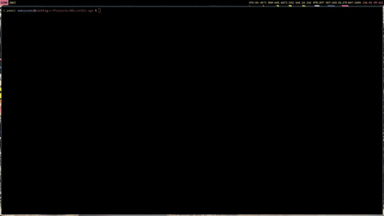

# RV32I VGA Controller and Co-Simulation Environment

<p align="center">
    <a href="https://codeberg.org/wirtnel/vga-driver-RV32I">
        </a>
    <a href="https://github.com/wirtnel/vga-driver-RV32I">
        </a>
</p>

Synthesizable VGA controller core written in Verilog, paired with two testbenches (static RGB, and animated RGB). The testing environment bridges hardware description language (HDL) simulation with a custom, cycle-accurate RISC-V (RV32I) software emulator via Cocotb and Python ctypes.

## Quick Preview


## System Architecture

The testbench verify hardware-software co-design by executing compiled RISC-V instructions inside a C-based architectural emulator while simultaneously driving a hardware VGA controller simulation.

1. Hardware (vga_core.v): Generates structural horizontal and vertical timing synchronization signals (h_sync, v_sync) and controls pixel coordinate streams for display pipes.
2. Software Emulator (extern/RV32I-emu): An [independent C library](https://codeberg.org/wirtnel/RV32I-emu) that maintains the RISC-V architectural state, processes instructions, and writes frame updates directly to a shared 42MiB DRAM allocation, easily can be modified to more or less in the proper C program before compiling (see [dram.h](./extern/RV32I-emu/includes/dram.h)).
3. Verification Bridge (bad-riscv.py): A Cocotb testbench that instantiates the hardware simulator, binds the compiled C emulator via dynamic runtime linkage (ctypes), and renders pixel buffers onto a host-side UI using Pygame and NumPy. There is also testbench.py, but it is mostly a legacy test I did first.

> You can, and I highly recommend, use [GTKwave](https://gtkwave.sourceforge.net/) for proper testing, I also helped myself quite a lot with [my own TUI for translating RISCV hex instructions](https://codeberg.org/wirtnel/riscv-tui)

## Repository Layout

```text
.
├── .gitmodules              # Submodule configuration for dependency tracking
├── Makefile                 # Cocotb simulation script
├── vga_core.v               # Top-level VGA controller Verilog hardware design
├── converter.py             # Little utility to convert any given .mp4 file into .bin
├── bad-riscv.py             # Cocotb test suite and Pygame runtime environment
└── extern/
    └── RV32I-emu/           # Git Submodule containing the C processor core
```

## Prerequisites

Ensure your development environment has the following toolchains installed:

* HDL Simulator: Icarus Verilog (iverilog) or Verilator
* C Compiler: GCC (supporting C11 and position-independent code -fPIC), it should work with others as well
* Python Runtime: Python 3.8+ with a configured virtual environment (.venv)
* Python Dependencies: listed in the [requirements.txt](./requirements.txt)

## Setup Instructions

### 1. Clone the Repository
Because this repository relies on an external repository for architectural simulation, you must initialize submodules when cloning:

```bash
git clone --recursive ssh://git@codeberg.org/wirtnel/vga-driver-RV32I.git
cd rv32i-vga
```

If you have already cloned the repository without the recursive flag, fetch the submodule dependencies manually:

```bash
git submodule update --init --recursive
```

### 2. Compile the RISC-V Emulator Shared Library
Navigate into the submodule directory and compile the dynamic target needed by the Python runtime environment:

```bash
cd extern/RV32I-emu
make lib
cd ../..
```

This builds libcorerv32.so with position-independent code attributes, enabling Python ctypes to map the emulator's memory layout directly into host execution space.

### 3. Install Python Dependencies
Activate your local virtual environment and install the required numerical and graphics packages:

```bash
source .venv/bin/activate
pip install -r requirements.txt
```

## Running the Simulation

Execute the automated test infrastructure via the root Makefile:

```bash
make
```

### Simulation Behavior
* Cocotb drives the system clock and resets the [vga_core](./vga_core.v) module.
* The C emulator executes compiled binaries in a separate thread, writing output grids into its internal memory map.
* On every falling edge of the hardware v_sync line, the Python testbench captures the raw 40x30 VRAM byte segment using zero-copy NumPy memory buffers (np.frombuffer).
* The data is parsed from its native packed RGB332 format, upscaled, and displayed inside a real-time Pygame desktop window to visually verify timing alignment and instruction behavior.

## License

Copyright (C) 2026 wirtnel

This project, including the core hardware driver configurations and verification
environments, is free software: you can redistribute it and/or modify it under
the terms of the GNU General Public License as published by the Free Software
Foundation, either version 3 of the License, or (at your option) any later version.

The `extern/RV32I-emu` submodule is an independent repository maintained under
the same author copyright and GPLv3 terms. See individual files and the
accompanying LICENSE file for details.
